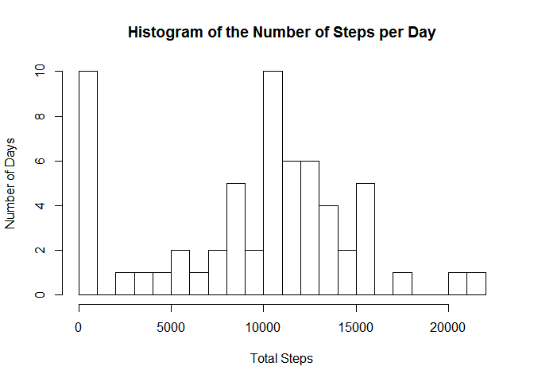
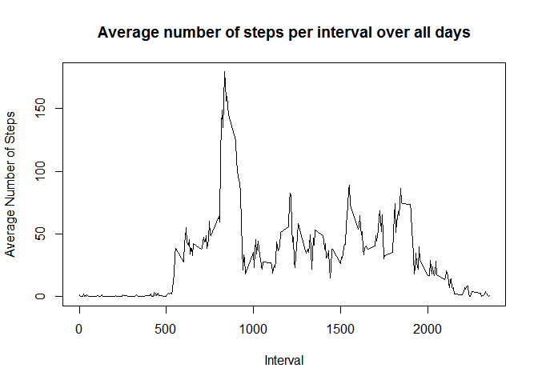
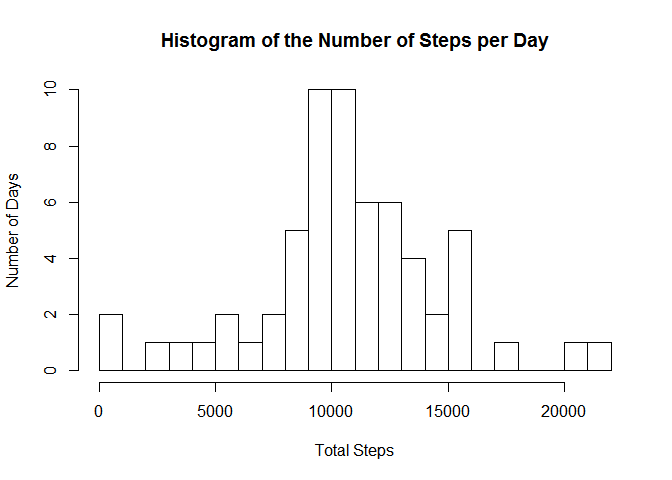
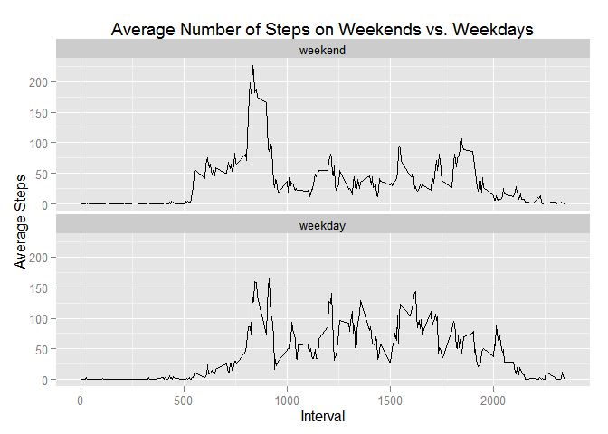

# Reproducible Research: Peer Assessment 1


## Loading and preprocessing the data


```r
library(data.table)
library(dplyr)
library(ggplot2)
```


```r
#read in the data and convert to data table format
dat <- read.csv("activity.csv")
dat_tbl <- data.table(dat)

#display 10 records
dat_tbl
```

```
##        steps       date interval
##     1:    NA 2012-10-01        0
##     2:    NA 2012-10-01        5
##     3:    NA 2012-10-01       10
##     4:    NA 2012-10-01       15
##     5:    NA 2012-10-01       20
##    ---                          
## 17564:    NA 2012-11-30     2335
## 17565:    NA 2012-11-30     2340
## 17566:    NA 2012-11-30     2345
## 17567:    NA 2012-11-30     2350
## 17568:    NA 2012-11-30     2355
```

## What is mean total number of steps taken per day?


```r
#calculate the number of steps taken per day
steps_by_day <- dat_tbl %>%
                group_by(date) %>%
                summarize(count = sum(steps, na.rm =T))

#display steps per day in a histogram
hist( steps_by_day$count
        , breaks = 20
        , xlab = "Total Steps"
        , ylab = "Number of Days"
        , main = "Histogram of the Number of Steps per Day")
```

 

```r
#get the average steps per day
avg_steps_day <- round(mean(steps_by_day$count),2)
avg_steps_day
```

```
## [1] 9354.23
```

```r
#get the median number of steps per day
median_steps_day <- median(steps_by_day$count)
median_steps_day
```

```
## [1] 10395
```

The mean number of steps taken per day was 9354.23   
The median number of steps taken per day was 10395


## What is the average daily activity pattern?


```r
#get the average number of steps by interval over all days
steps_by_interval <- dat_tbl %>%
                    group_by(interval) %>%
                    summarise(avg_steps =  sum(steps, na.rm = T)/n())

#view a time series plot of the average steps per interval
plot(steps_by_interval$interval
     , steps_by_interval$avg_steps
     , type="l"
     , xlab = "Interval"
     , ylab = "Average Number of Steps"
     , main = "Average number of steps per interval over all days")
```

 

```r
#get the maximum of the average steps per intveral 
interval_with_max_steps <- filter(steps_by_interval
                                  , avg_steps == max(steps_by_interval$avg_steps)
                                  ) %>%
                            select(interval)

#print the interval with the max steps
interval_with_max_steps$interval
```

```
## [1] 835
```

The maximum number of steps on average for all 5 minute intervals is interval 835


## Inputing missing values


```r
#get the number of records that have missing values in the steps column
num_recs_na <-count(filter(dat_tbl, is.na(steps)))
num_recs_na$n
```

```
## [1] 2304
```
1. The total number of rows with NAs is 2304 

2. To fill in the missing values we will take the mean value for the interval over all days


```r
#store the data that is complete
complete_dat <- filter(dat_tbl, !is.na(steps))

#get the data that has missing values and merge it with our table of average number of steps per interval
#then select just the relavent columns needed to join back to the complete data
incomplete_dat <- select(
                    merge(
                        filter(dat_tbl, is.na(steps)) 
                        , steps_by_interval
                        , by = "interval")
                    , steps = avg_steps
                    , date
                    , interval)

#re-join all data and print sample
all_dat <- rbind(complete_dat, incomplete_dat) 
all_dat 
```

```
##            steps       date interval
##     1: 0.0000000 2012-10-02        0
##     2: 0.0000000 2012-10-02        5
##     3: 0.0000000 2012-10-02       10
##     4: 0.0000000 2012-10-02       15
##     5: 0.0000000 2012-10-02       20
##    ---                              
## 17564: 0.9344262 2012-11-04     2355
## 17565: 0.9344262 2012-11-09     2355
## 17566: 0.9344262 2012-11-10     2355
## 17567: 0.9344262 2012-11-14     2355
## 17568: 0.9344262 2012-11-30     2355
```

3. Now that the missing values have been filled in we will summarize the data and look at the histogram


```r
#get the number of steps per day using the filled in data set
steps_by_day <- all_dat %>%
                group_by(date) %>%
                summarize(count = sum(steps,na.rm=T))

#plot a histogram to view the distribution       
hist(steps_by_day$count
     , breaks = 20
     , xlab = "Total Steps"
     , ylab = "Number of Days"
     , main = "Histogram of the Number of Steps per Day")
```

 

```r
#get the average number of steps from the filled in dataset
avg_steps_day_all <- round(mean(steps_by_day$count))

#get the median number of steps from the filled in dataset
median_steps_day_all <- median(steps_by_day$count)
```
4. The mean number of steps after filling in the missing values is 10581 which is higher than before we filled in the missing values.
The median number of steps after filling in the missing values is 10395 which is the same as before we filled in the missing values.


## Are there differences in activity patterns between weekdays and weekends?

1. First we create a new factor variable that indicates if the date is a weekday or weekend


```r
#first convert the date column to a date format
all_dat$date <- as.Date(all_dat$date)

#create a vector of the weekday names
wd <- c('Monday', 'Tuesday', 'Wednesday', 'Thursday', 'Friday')

#create a new column called weektype which will be a factor variable with the values weekend and weekday
all_dat$weektype <- factor(
                            (weekdays(all_dat$date) %in% wd)
                            , levels=c(FALSE, TRUE)
                            , labels=c('weekend', 'weekday')
                            ) 
```

Now we will investigate the difference between weekends and weekdays


```r
# get the average steps per interval for weekdays and weekends
steps_by_weektype <-    all_dat %>%
                        group_by(weektype, interval) %>%
                        summarize(avg = mean(steps))

#plot the weekend and weekday series
d <- ggplot(data = steps_by_weektype
            , aes(x = steps_by_weektype$interval 
                  , y = steps_by_weektype$avg)
            ) +
         geom_line() +
         scale_x_continuous() +
         facet_wrap(~ weektype, ncol=1) +
         xlab("Interval") +
         ylab("Average Steps") +
         ggtitle("Average Number of Steps on Weekends vs. Weekdays")
d
```

 

#####Summary

- On the weekend on average more steps are taken mid morning that on the weekdays.    
- We can also see that on weekdays on average steps are taken more consistently thoughout the day whereas on the weekend after the late morning spike in steps the number of steps drops.     
- On both the weekend and weekdays very few to no steps are taken late at night and early in the morning. 

